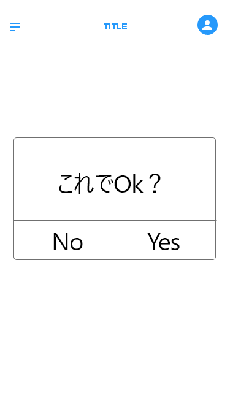

2. 画⾯レイアウト (⽂責: 名前(○○⼤)) 

    1. Create_an_Account画面

    

    |番号|名称|概要|
    |:---|:----------------------:|:------------------------------------------:|
    |1   |Name入力フォーム　　　　　　|ID を⼊⼒する際にタップし，英数字を⼊⼒．      |
    |2   |email入力フォーム　　　　　　|ID を⼊⼒する際にタップし，英数字を⼊⼒．      |
    |3   |パスワード⼊⼒フォーム　　|パスワードを⼊⼒する際にタップし，英数字を⼊⼒．|
    |4   |パスワード再⼊⼒フォーム　 ID，パスワードを⼊⼒後にタップし，画⾯遷移．  |
    |5   |新規アカウント　作成ボタン|新規ユーザがアカウント作成画⾯へ遷移．         |

    2. menu画面 

    

    |番号|名称|概要|
    |:---|:----------------------:|:------------------------------------------:|
    |1   |販売ボタン　　      　　　|Seller画面に遷移      |
    |2   |購入ボタン　　　　        |Buyer画面に遷移      |

    3. User_Select画面 

    

    |番号|名称|概要|
    |:---|:----------------------:|:------------------------------------------:|
    |1   |売るボタン　　      　　　|Seller画面に遷移      |
    |2   |買うボタン　　　　        |Buyer画面に遷移      |

    4. Seller画面

    

    |番号|名称|概要|
    |:---|:----------------------:|:------------------------------------------:|
    |1   |"商品登録"ボタン　　      　　　|Photo画面に遷移      |
    |2   |"プロフィール更新"ボタン　　　  |S_map画面に遷移      |

    5. Photo画面

    

    |番号|名称|概要|
    |:---|:----------------------:|:------------------------------------------:|
    |1   |写真を撮る　　      　　　|Photo_decide画面に遷移      |

    6. Photo_decide画面

    

    |番号|名称|概要|
    |:---|:----------------------:|:------------------------------------------:|
    |1   |"Yes"ボタン　　    　　　|price画面に遷移      |
    |2   |"NO"ボタン       　　　  |Seller画面に遷移      |

    7. price画面

    

    |番号|名称|概要|
    |:---|:----------------------:|:------------------------------------------:|
    |1   |値段入力フォーム    　　　|値段を入力     |
 
    8. Price_decide画面

    

    |番号|名称|概要|
    |:---|:----------------------:|:------------------------------------------:|
    |1   |値段入力フォーム    　　　|値段を入力     |
    |2   |"決定"ボタン       　　　|農薬画面に遷移     |
 

    9. 農薬画面

    

    |番号|名称|概要|
    |:---|:----------------------:|:------------------------------------------:|
    |1   |"Yes"ボタン　　    　　　|農薬_確定画面に遷移      |
    |2   |"NO"ボタン       　　　  |price画面に遷移      |

    10. 農薬画面

    

    |番号|名称|概要|
    |:---|:----------------------:|:------------------------------------------:|
    |1   |"Yes"ボタン　　    　　　|Seller画面に遷移      |
    |2   |"NO"ボタン       　　　  |農薬画面に遷移      |

    
    11. S_map画面

    

    |番号|名称|概要|
    |:---|:----------------------:|:------------------------------------------:|
    |1   |"決定"ボタン　　    　　　|profile画面に遷移      |

    12. S_map画面

    

    |番号|名称|概要|
    |:---|:----------------------:|:------------------------------------------:|
    |1   |プロフィール画面　　    　　　|プロフィールを編集できる      |

    13. buyer画面

    

    |番号|名称|概要|
    |:---|:----------------------:|:------------------------------------------:|
    |1   |"販売所の場所"のボタン  　|B_map画面に遷移      |

    14. B_map画面

    

    |番号|名称|概要|
    |:---|:----------------------:|:------------------------------------------:|
    |1   |map上のピンを押す  　|Yasai画面に遷移      |

    15. Yasai画面

    

    |番号|名称|概要|
    |:---|:----------------------:|:------------------------------------------:|
    |1   |"Yasai"タイルを選択 　|payment画面に遷移      |

    16. payment画面

    

    |番号|名称|概要|
    |:---|:----------------------:|:------------------------------------------:|
    |1   |"決定"ボタン 　|Buy_Decideのポップアップを出す      |

    17. Buy_decide画面

    

    |番号|名称|概要|
    |:---|:----------------------:|:------------------------------------------:|
    |1   |"OK"ボタン 　|Buy_Decideのポップアップを出す      |
    |2   |"Cancel"ボタン 　|buyer画面に遷移      |