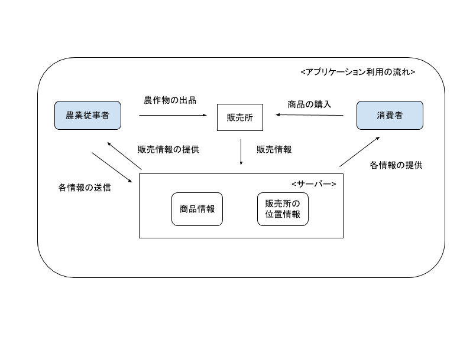

1. 概要図 (⽂責: 野上(専修⼤))
   
   本サービスは、売り手となる農業従事者が容易に農産物を販売所に出品でき、買い手となる消費者は容易に販売所を見つけ、希望する農産物を購入することができるサービスである。売り手は、販売所にて農作物を出品する際に、アプリケーションを利用して、販売場所の位置情報登録、商品情報(種類、生産者情報、個数等)の登録を行う。消費者はアプリケーションを通じて、販売所の位置情報、売られている商品情報を知り、現地に赴き、商品を購入する。

      